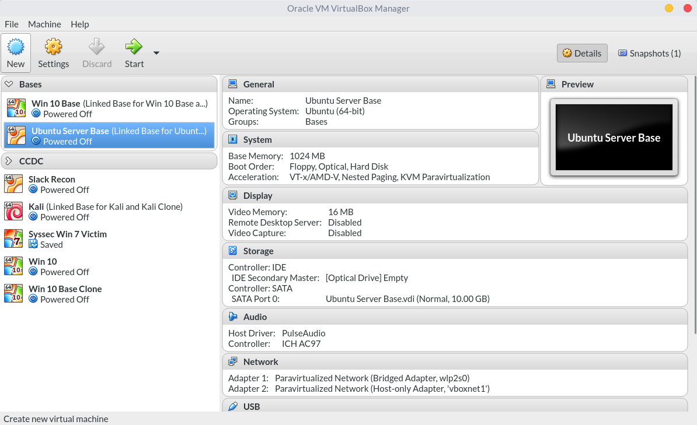
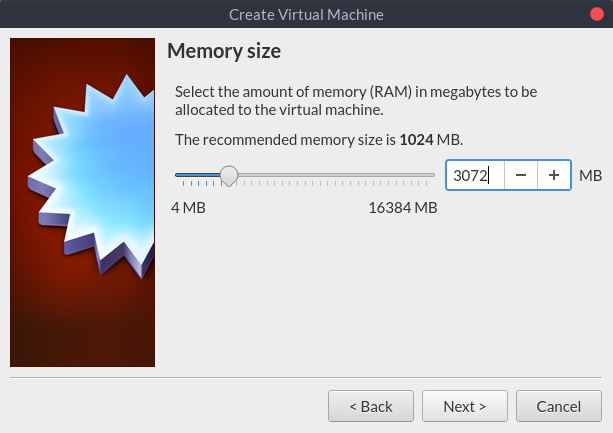
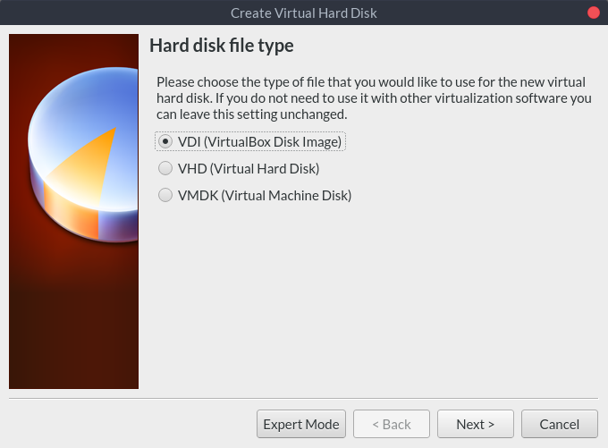
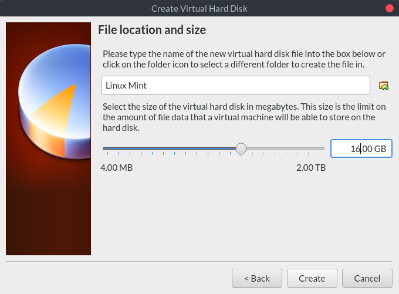
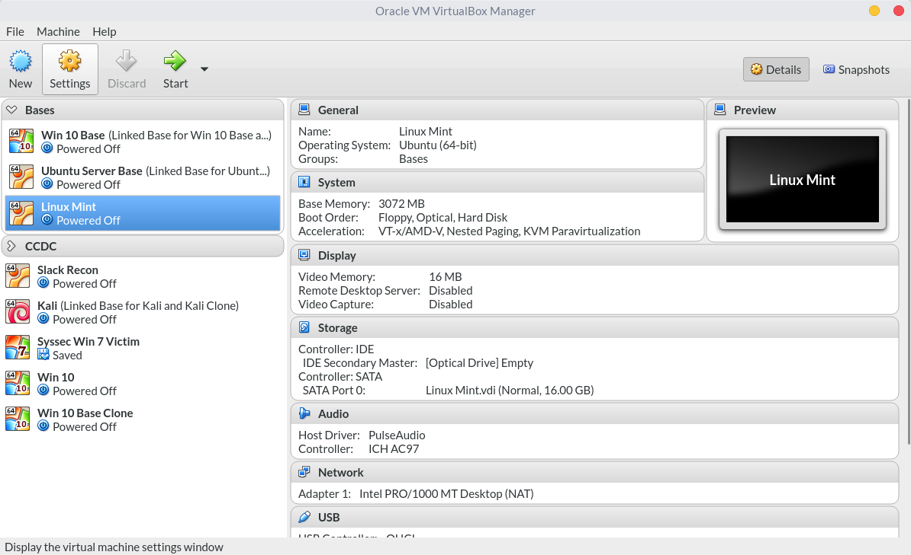

# 2018-01-21 Pre-meeting Notes

I'm excited to see everyone this Friday for the first Reverse Engineering
(RE)/binary exploitation/CTF training meeting this semester! This github
repository is where I will be uploading instructions before each meeting,
materials for use during the meeting, and if I give a challenge during the
meeting, I will upload the solution here a couple days after the meeting.

Make sure you're on our [Slack](https://wcscusf.slack.com/signup), as this is
our primary method of communication, and the [mailing
list](http://lists.acomp.usf.edu/mailman/listinfo/wcsc), as this is how we send
out weekly announcements.

## Before Friday

Before we get started on Friday, I would like everyone to have either a native
installation of some Linux distribution, or a VM.

### How do I do that?

1. Install [VirtualBox](https://www.virtualbox.org/wiki/Downloads). VirtualBox
   is free, so I recommend it to anyone getting started. Click the download link
   for your OS (probably Windows or MacOS).
2. Download [Linux Mint](https://linuxmint.com/edition.php?id=246) or
   [Ubuntu](https://linuxmint.com/edition.php?id=246) (I'd recommend the latest
   version on that page instead of the current LTS version) or
   [Fedora](https://getfedora.org/en/workstation/download/). It doesn't really
   matter which distro we're running, but there are tons of guides out there for
   Ubuntu, and 99% of what applies to Ubuntu applies to Mint.
3. Create a new VM in VirtualBox 
   1. Give it a name and select the type of OS it is (this only affects the menu
      icon and sets some sensible default settings). 
   2. Allocate at least 2 GB of RAM for the VM (but make sure you leave your
      host OS with enough). 
   3. Create a virtual hard disk. 
   4. The default VDI format is fine. 
   5. Make sure you dynamically allocate this space, so it only uses as much
      space on your host disk as you use inside the VM. 
   6. Give a name for the disk image file, and set a maximum size. I would
      recommend at least 16 GB, as resizing it later on is a bit of a pain.
      Remember, it doesn't use all of this storage at once, but only as the VM
      uses space. .
   7. After creating the VM, we need to edit a couple of its settings.
      
   8. Unless you have reasons not to, enable VT-x/AMD-V, as this will speed up
      virtualization. 
   9. Add the ISO you downloaded to the optical drive by clicking empty disk
      under the IDE controller and then clicking the dropdown next to "IDE
      Secondary Master". 
4. Now start the VM and follow the on-screen dialogs to install the guest OS on
   the virtual hard disk. You can choose to use "the whole disk" (instead of
   manually partitioning), since no other OS will be booting off this virtual
   hard disk.
5. After restarting, log into your user using the credentials you set up during
   installation.
6. Make sure you have access to a terminal in whatever distro you chose. In
   GNOME, which is what Ubuntu and Fedora come with by default, you should be
   able to hit the super key (aka the Windows key, the command key, or the
   system key) and type "Terminal". In cinnamon, which is what Mint comes with
   by default, you should be able to click the button in the bottom-left corner,
   and the click the terminal icon. You don't have to know how the shell works,
   as I'll be explaining that on Friday.
7. (Optional) Install VirtualBox Guest Additions.

Awesome! We have a Linux VM up and running. We will be using this extensively on
Friday. If you know how to, make sure `gcc` and `gdb` are installed.

### Installing git and cloning this repository

Last but not least, make sure to clone this repository, since this is where I'll
be putting all of the material for our meetings.

1. Open the terminal
2. `git` should already be installed. You can check this by running `which git`.
   If it prints out a path, you're good. If not, you need to install git
   * Ubuntu, Mint:

    sudo apt install git
    <type in password>

   * Fedora:

    sudo dnf install git
    <type in password>

3. Clone the repository by running `git clone https://github.com/kevorr/ctf-training`.

When I upload new stuff, you can update your copy to match mine by running `git
pull origin master` inside the directory that it cloned into initially.

## Questions?

If you have any questions, contact me on slack (I'm @kevin) or shoot out a
message in the #general channel.
